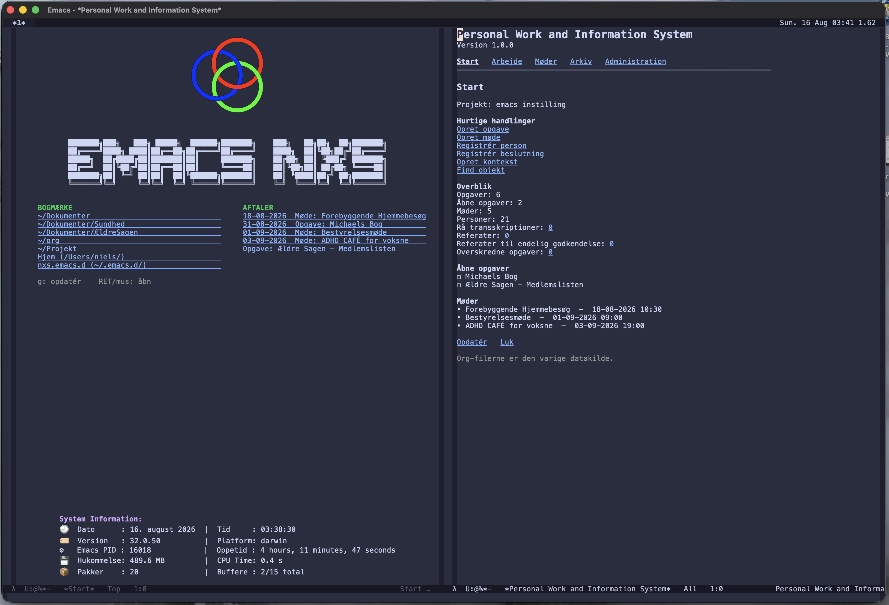

# Personal Work and Information System

PerInf 1.0 is an Org-backed personal information and work-management system
for Emacs.



*Personal Information System – shown here in the Danish version*

It can be used as an alternative to, or a supplement for, Org Agenda. It keeps
ordinary Org files as the source of truth while providing
a unified interface for tasks, meetings, people, decisions, documents,
transcripts, and human-approved minutes.

## Highlights

- controlled task and meeting workflows, including persistent work timers
- a dedicated people view with editable contacts and reusable groups
- separate archive sections for completed and cancelled records
- links from meeting evidence through minutes and decisions to resulting tasks
- managed audio and document imports with checksums and stable identifiers
- explicit human review and approval of generated minutes
- interfaces in English, Danish, French, German, and Spanish

Groups are selection aids rather than references of their own. Selecting a
group for a task or meeting records its current members as individual, stable
person references. Later membership changes therefore never rewrite historical
tasks or meetings. People and groups are archived instead of permanently
deleted and can be reactivated later.

Transcription and text generation are intentionally kept outside the core.
Plugins may create artifacts, but PerInf records their provenance and requires
human approval before minutes become final.

## Work timers and recorded activity

Each active task can have its own work timer, and several task timers may run
at the same time. PerInf stores both accumulated work time and the start of the
current interval, so elapsed time survives Emacs restarts and remains available
after a task is completed or cancelled. Work time is displayed as `H:MM:SS`.

An open Emacs buffer or file can be associated with one active task. File paths
and names of non-file buffers are stored with the task. Once a file has been
associated, PerInf recognizes it automatically when it is opened again. While
the task timer is running, activity in that buffer updates the task's **last
recorded activity** at most once per minute. PerInf deliberately does not infer
which task unrelated keyboard or mouse activity belongs to.

Use the **Associate open buffer or file** action in a task's detail view, or run
`M-x perinf-associate-buffer-with-task` from the work buffer. Starting a timer
with `M-x perinf-start-task-timer` from a work buffer associates that buffer
automatically. Use `M-x perinf-dissociate-buffer-from-task` to remove the
association.

PerInf checks running timers once per minute. A timer is stopped automatically
after 15 minutes without recorded activity, independently of other running
timers. The work interval ends exactly at the 15-minute boundary, and Emacs
shows a minibuffer message naming the task that was stopped. For a running
timer created before activity tracking was available, the timer start time is
used as the fallback activity time.

## Getting started

Add the repository to Emacs' `load-path`, then evaluate:

```elisp
(require 'perinf)
```

Start PerInf with `M-x perinf`. From the start page, create a new project or
open an existing one. Projects remain normal, portable Org directories.

## Development and packaging

```text
make test
make compile
make package
```

`make package` creates `dist/perinf-1.0.0.tar`, which can be installed with
`M-x package-install-file`.

## License

PerInf is free software licensed under GNU GPL version 3 or any later version.
See [LICENSE](LICENSE).
